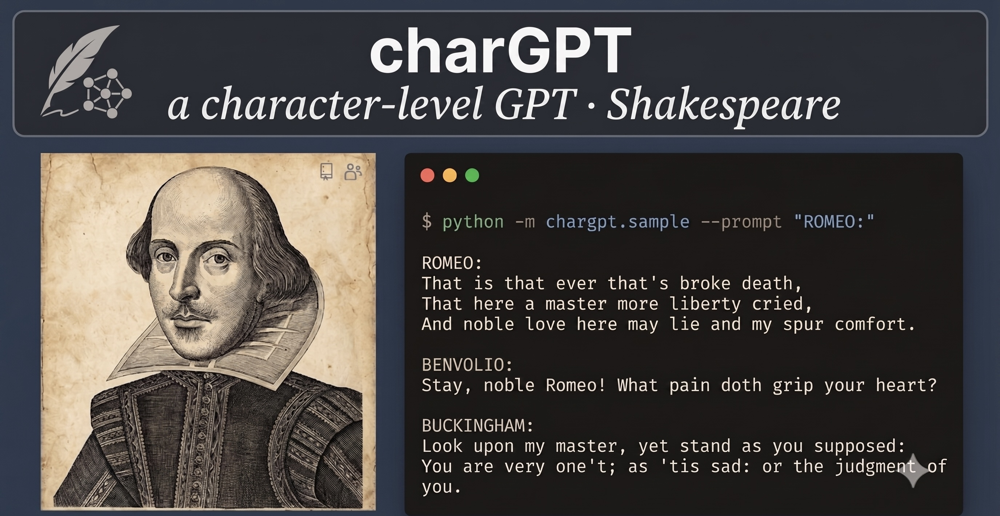
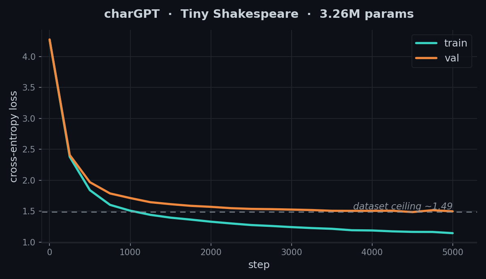

# charGPT



A character-level GPT you can read in one sitting.

`charGPT` is a small, from-scratch implementation of a decoder-only Transformer —
the architecture behind GPT — trained to generate text one character at a time.
The whole model lives in a single readable file ([`chargpt/model.py`](chargpt/model.py)):
self-attention, multi-head attention, feed-forward blocks, residual connections and
LayerNorm, with no framework magic beyond PyTorch tensors. Inspired by Andrej
Karpathy's [nanoGPT](https://github.com/karpathy/nanoGPT) and his
["Let's build GPT from scratch"](https://www.youtube.com/watch?v=kCc8FmEb1nY) video.

Train it on Tiny Shakespeare in a few minutes on a laptop and watch it go from
random noise to (almost) readable Elizabethan English.

```
ROMEO:
That is that ever that's broke death,
That here a master more liberty cried,
And noble love here may lie and my spur comfort.

BUCKINGHAM:
Look upon my master, yet stand as you supposed:
You are very one't; as 'tis sad: or the judgment of you.
```
<sub>Real sample from a ~3M-parameter model (val loss ≈ 1.49) after training on Tiny Shakespeare.</sub>

## Install

Clone and install in editable mode (recommended for tinkering):

```bash
git clone https://github.com/zzkai098/charGPT.git
cd charGPT
pip install -e ".[dev]"
```

Or install the runtime package directly from GitHub:

```bash
pip install git+https://github.com/zzkai098/charGPT.git
```

## Quickstart

**1. Get the data** (Tiny Shakespeare, ~1 MB):

```bash
python data/download.py
```

**2. Train** a small model and save a checkpoint:

```bash
python -m chargpt.train --steps 5000
```

**3. Generate** text from the trained checkpoint:

```bash
python -m chargpt.sample --tokens 500 --prompt "ROMEO:"
```

After `pip install`, the `chargpt-train` and `chargpt-sample` console commands do
the same thing.

**Prefer a GPU?** Open [`examples/colab_train.ipynb`](examples/colab_train.ipynb) in
Google Colab to train the full ~11M-parameter model on a free T4 in a few minutes.

## Train on your own text

charGPT is data-agnostic — any UTF-8 text file works. Just point `--data` at it:

```bash
python -m chargpt.train --data path/to/your.txt --out checkpoints/mine.pt
python -m chargpt.sample --ckpt checkpoints/mine.pt --prompt "..."
```

The vocabulary is built automatically from the characters in your file, so you can
train on source code, poetry, song lyrics, or Chinese text. For large vocabularies
(e.g. Chinese), bump `--n-embd` and give it more `--steps`.

## Use it from Python

```python
import torch
from chargpt import GPT, GPTConfig, CharTokenizer

text = open("data/input.txt").read()
tok = CharTokenizer(text)

config = GPTConfig(vocab_size=tok.vocab_size, block_size=128, n_embd=192,
                   n_head=6, n_layer=6)
model = GPT(config)
print(f"{model.num_params() / 1e6:.2f}M parameters")

# generate from a cold model (gibberish until trained)
idx = torch.zeros((1, 1), dtype=torch.long)
print(tok.decode(model.generate(idx, max_new_tokens=200)[0].tolist()))
```

Training loop, in full:

```python
from chargpt import get_batch, load_data

train_data, val_data, tok = load_data("data/input.txt")
optimizer = torch.optim.AdamW(model.parameters(), lr=3e-4)

for step in range(5000):
    x, y = get_batch(train_data, config.block_size, batch_size=32)
    _, loss = model(x, y)          # forward returns (logits, loss)
    optimizer.zero_grad(set_to_none=True)
    loss.backward()                # backprop
    optimizer.step()
```

## How it works

The model is the classic GPT stack, built up from the smallest piece:

| Component | What it does |
|---|---|
| `Head` | One head of causal self-attention — each token attends to its own past |
| `MultiHeadAttention` | Several heads in parallel, concatenated and projected |
| `FeedForward` | A per-token MLP with a 4× hidden expansion |
| `Block` | `x = x + attn(ln(x))` then `x = x + ffn(ln(x))` — pre-LN + residuals |
| `GPT` | token + position embeddings → N × `Block` → LayerNorm → `lm_head` |

The causal mask (a lower-triangular `tril` matrix) is what makes it a *language
model*: position `t` can only see positions `≤ t`, so predicting the next
character never peeks at the answer.

A full, step-by-step walkthrough — from a counting bigram baseline up to the full
Transformer — lives in [`examples/build_gpt.ipynb`](examples/build_gpt.ipynb).

## Training

The run below is a **3.26M-parameter** model — `block_size=256, n_embd=256,
n_head=4, n_layer=4, dropout=0.2` — trained on Tiny Shakespeare for 5000 steps
(a few minutes on a Colab GPU):

```bash
python -m chargpt.train --block-size 256 --n-embd 256 --n-head 4 --n-layer 4 \
                        --dropout 0.2 --steps 5000
```



Validation loss bottoms out around **1.49** — roughly the ceiling for this ~1 MB
dataset. Past that, a bigger model just overfits (`train` keeps dropping while
`val` flattens) rather than generalizing better.

## Limitations & possible extensions

- **No "save-best" checkpointing.** `train.py` saves once, after the final step,
  so if validation loss bottoms out mid-run and then overfits, the saved model is
  the last one — not the best. Tracking the lowest-val checkpoint (early stopping)
  would be a small, worthwhile addition.
- **Character-level only.** A byte-level BPE tokenizer would shorten sequences and
  let the same architecture scale to larger corpora.
- **Fixed context window.** `block_size` caps how far back the model can attend;
  longer contexts cost O(T²) attention.

## Features

- Complete decoder-only Transformer in one readable file
- Causal multi-head self-attention with a registered `tril` buffer mask
- Pre-LayerNorm blocks with residual connections
- Character-level tokenizer with no external dependencies
- Training CLI with train/val loss tracking and `state_dict` checkpoints
- Sampling CLI with temperature and top-k control
- Tested: forward shapes, causal masking, generation bounds, encode/decode round-trip

## API

```python
from chargpt import GPT, GPTConfig, CharTokenizer, load_data, get_batch

config = GPTConfig(vocab_size=65, block_size=128, n_embd=192, n_head=6, n_layer=6)
model = GPT(config)

logits, loss = model(idx, targets)              # training forward
out = model.generate(idx, max_new_tokens=500,   # autoregressive sampling
                     temperature=1.0, top_k=None)
```

## Development

```bash
pip install -e ".[dev]"
python -m pytest -v          # run the test suite
```

The tests cover tensor shapes, that the causal mask actually blocks the future,
that `generate()` never leaves the vocabulary or over-runs the context window, and
that the tokenizer round-trips exactly.

## Project layout

```
charGPT/
├── chargpt/
│   ├── __init__.py
│   ├── model.py       # the Transformer: Head / MultiHeadAttention / Block / GPT
│   ├── data.py        # CharTokenizer + batch loader
│   ├── train.py       # training loop + CLI, saves a state_dict checkpoint
│   └── sample.py      # load a checkpoint and generate text
├── tests/
│   ├── test_model.py     # shapes, causal masking, generation bounds
│   └── test_data.py      # encode/decode round-trip, batch shapes
├── examples/
│   └── build_gpt.ipynb   # bigram → self-attention → full GPT, step by step
├── data/
│   └── download.py       # fetch Tiny Shakespeare
├── assets/               # figures used in this README
└── README.md
```

## License

MIT © 2026 Zhankai Zhang
